### Hi there, I'm Benoît Lagasse👋
- Passion for 3D printing 🖨️ and electronics 🔌
- 🎓 I got my bachelor degree in electronics and ICT
- 🎓 Currently studying and working in France
- 🥅 Current Goal: learn more about (humanoid) Robotics 🤖

### Connect with me:

### Languages:

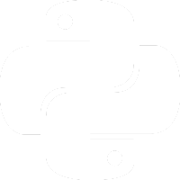

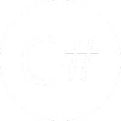

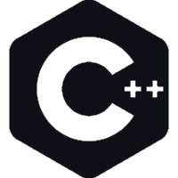
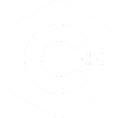

 

### Tools:

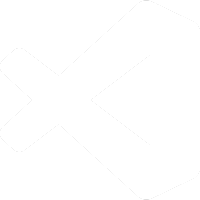

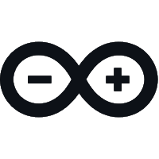
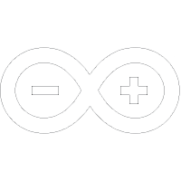

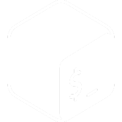

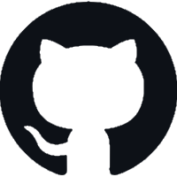
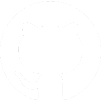

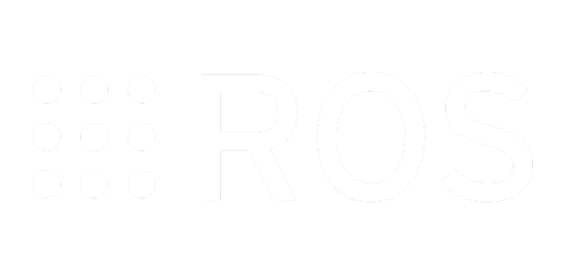

 

 
  
:zap: GitHub Stats

  
 

[twitter]: https://twitter.com/Benoit_Lagasse
[youtube]: https://www.youtube.com/channel/UCuAWMRR3BdT-krnY0wwdvYg
[linkedin]: https://www.linkedin.com/in/benoit-ldl
